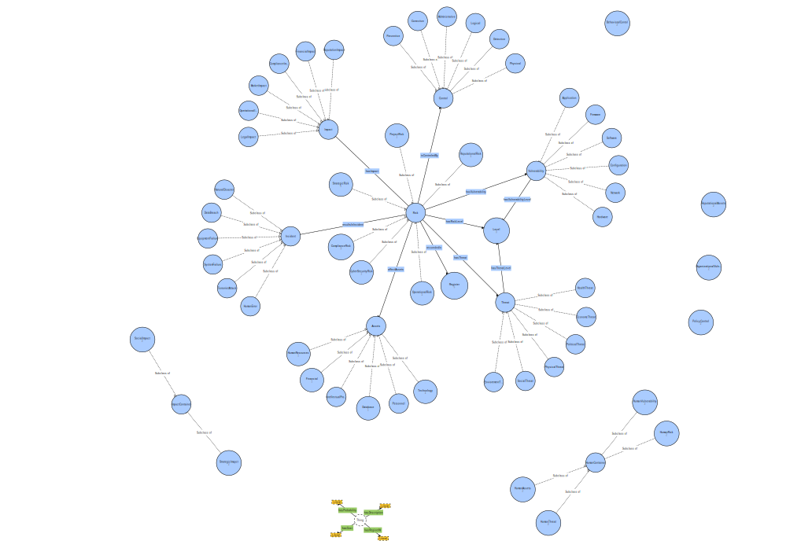

# Security Disclaimer Ontology (SDS)

## Overview
The **Security Disclaimer Ontology (SDS)** provides a formalized framework for representing the various elements involved in disclaiming security responsibilities. It defines a structured vocabulary that can be used to describe key security concepts such as risks, liabilities, legal considerations, and mitigations. By modeling these concepts, the ontology helps organizations communicate security disclaimers more effectively, ensuring stakeholders are aware of the limitations and responsibilities associated with security aspects of a system.

The SDS ontology is applicable in contexts such as legal documentation, compliance audits, cybersecurity risk assessments, and privacy assessments. It allows for a comprehensive understanding of security liabilities and provides a foundation for analyzing and mitigating risks.

## Purpose
The primary goals of the Security Disclaimer Ontology are:
- **Facilitating Communication**: Help organizations articulate security disclaimers clearly, outlining the scope of responsibilities and limitations concerning security.
- **Risk Management**: Assist in identifying, assessing, and mitigating security risks by providing a structured way to link risks to their sources, threats, vulnerabilities, and impacts.
- **Ensuring Compliance**: Help organizations ensure that their disclaimers align with industry standards and legal requirements, minimizing compliance risks.
- **Incident Management**: Support the tracking and understanding of security incidents and their impacts, improving response and mitigation strategies.

## Core Concepts and Classes
The ontology consists of several core classes, each representing a distinct aspect of security disclaimers. These classes are further divided into subclasses to capture specific details. Below is a description of the main classes and their subclasses.

### 1. Disclaimer
The **Disclaimer** class serves as the root for modeling various types of disclaimers that an organization might issue regarding security responsibilities. It includes the following subclasses:
- **LegalDisclaimer**: This subclass represents disclaimers related to legal responsibilities, limitations, or liabilities in the context of security. It may involve clauses that waive liability for damages arising from security issues.
- **TechnicalDisclaimer**: This subclass covers disclaimers regarding technical limitations, such as system vulnerabilities, the scope of security protections, or performance guarantees.
- **PrivacyDisclaimer**: This subclass pertains to disclaimers related to data privacy, such as how personal information is handled, stored, and protected under security measures.

### 2. Risk
The **Risk** class represents potential security threats or vulnerabilities that could impact an organization's security posture. It includes the following subclasses:
- **SecurityRisk**: This subclass identifies risks related to security breaches, including unauthorized access, data leaks, or cyber-attacks such as hacking or malware.
- **OperationalRisk**: This subclass relates to risks originating from internal processes or system failures, such as human error or inadequate security practices within an organization.
- **ComplianceRisk**: This subclass addresses risks related to failure in meeting legal or regulatory security requirements, such as data protection laws or industry-specific compliance standards.
- **ReputationalRisk**: This subclass concerns the risk to an organization's reputation due to security failures, such as data breaches that damage trust with customers or stakeholders.

### 3. Threat
The **Threat** class describes potential malicious actions or events that could lead to a security breach or risk. The following subclasses capture specific types of threats:
- **CyberThreat**: This subclass includes digital threats like hacking attempts, phishing attacks, malware, or distributed denial of service (DDoS) attacks.
- **HumanThreat**: This subclass deals with threats posed by human actions, either intentional (e.g., insider threats) or unintentional (e.g., employee errors or lapses in security awareness).
- **PhysicalThreat**: This subclass covers physical threats to assets, such as theft, vandalism, or unauthorized access to premises or physical security systems.

### 4. Vulnerability
The **Vulnerability** class identifies weaknesses that can be exploited by threats to cause security risks. It includes the following subclasses:
- **ApplicationVulnerability**: This subclass refers to software-related vulnerabilities, such as bugs, unpatched systems, or flaws in coding practices that could be exploited by attackers.
- **NetworkVulnerability**: This subclass focuses on weaknesses in network infrastructure, such as misconfigurations, unsecured communication channels, or exposed network services.
- **ComplianceVulnerability**: This subclass addresses weaknesses in an organization's compliance with security regulations, such as insufficient security measures to meet industry standards or legal requirements.

### 5. Impact
The **Impact** class defines the consequences or outcomes of security risks being realized. It includes the following subclasses:
- **FinancialImpact**: This subclass captures the monetary costs resulting from a security incident, such as legal fees, fines, remediation costs, or business disruption.
- **ReputationalImpact**: This subclass deals with the damage to an organization's public image or credibility, which may occur due to security breaches or failures.
- **LegalImpact**: This subclass focuses on the legal consequences that may arise from security incidents, such as lawsuits, regulatory penalties, or legal action due to non-compliance.

### 6. Control
The **Control** class represents various measures that can be put in place to manage and mitigate security risks. These controls are divided into:
- **PreventiveControl**: This subclass includes measures designed to prevent security risks from occurring, such as firewalls, intrusion detection systems, or secure coding practices.
- **DetectiveControl**: This subclass involves measures that detect and alert organizations to potential security incidents, such as monitoring systems, anomaly detection, or security audits.
- **CorrectiveControl**: This subclass focuses on actions taken to mitigate or correct security failures after they have been identified, such as patching vulnerabilities, incident response, or system restoration.

### 7. Incident
The **Incident** class categorizes events that represent security breaches or failures. It includes the following subclasses:
- **DataBreachIncident**: This subclass describes incidents where sensitive data is accessed or exposed without authorization.
- **SystemFailureIncident**: This subclass refers to incidents where critical systems or services fail, potentially compromising security or operational performance.
- **ComplianceIncident**: This subclass deals with incidents that result in violations of security regulations or laws, such as failure to meet compliance standards or data protection requirements.

## Object Properties
The ontology also defines several object properties to model the relationships between different classes. These relationships describe how different concepts in the ontology interact with each other.

- `hasThreat`: Links a **Risk** to the **Threat** that could cause it. This relationship helps connect risks to their sources.
- `hasVulnerability`: Associates a **Risk** with the **Vulnerability** that could be exploited to realize the risk.
- `affectsAsset`: Identifies the **Asset** (e.g., data, systems, infrastructure) that is impacted by a particular **Risk**.
- `hasImpact`: Specifies the consequences or outcomes (**Impact**) that result from a **Risk** being realized.
- `isMitigatedBy`: Links a **Risk** to the **Control** mechanisms (preventive, detective, or corrective) that mitigate or reduce the risk.
- `resultsInIncident`: Describes the **Incident** that is caused by a **Risk** being realized.

## Graph

