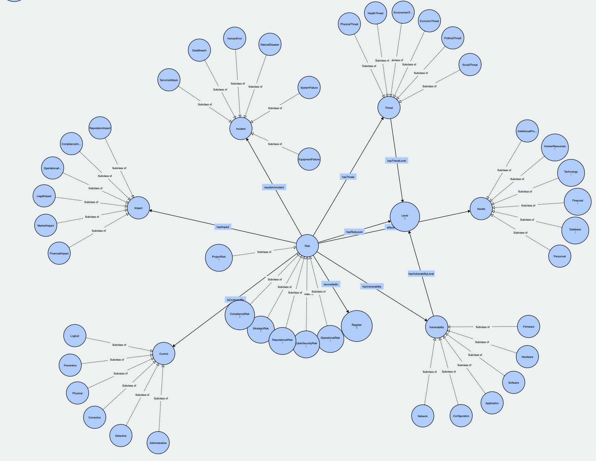

# Security Disclaimer Ontology (SDS)

## Overview
The **Security Disclaimer Ontology (SDS)** is a way to clearly represent and explain important aspects of security disclaimers. It uses a structured vocabulary to describe concepts like risks, responsibilities, legal issues, and solutions. This ontology helps organizations communicate their security disclaimers more clearly so that everyone understands the limitations and responsibilities regarding security.

SDS can be used in many areas like legal documents, compliance checks, cybersecurity assessments, and privacy audits. It helps organizations understand security risks and find ways to reduce them.

## Purpose
The main goals of the Security Disclaimer Ontology are:
- **Clear Communication**: Help organizations explain their security disclaimers in simple terms, so everyone knows what they are responsible for and what they aren't.
- **Risk Management**: Help organizations identify, understand, and reduce security risks by linking risks to their causes, threats, weaknesses, and effects.
- **Compliance**: Help ensure that the disclaimers follow legal and industry rules, reducing the risk of breaking any laws.
- **Incident Management**: Help organizations track and manage security problems, making it easier to fix them and prevent future issues.

## Core Concepts and Classes
The ontology includes several main categories (classes), each representing a different part of security disclaimers. Each class is divided into subcategories to give more specific details. Here’s an overview of the main classes:

### 1. Disclaimer
The **Disclaimer** class represents different types of disclaimers that organizations can use about security. The subclasses include:
- **LegalDisclaimer**: Covers disclaimers related to legal matters, such as statements that limit the organization’s legal responsibility for security problems.
- **TechnicalDisclaimer**: Deals with disclaimers about technical limitations, like security flaws or the scope of protection.
- **PrivacyDisclaimer**: Includes disclaimers about how personal information is stored and protected.

### 2. Risk
The **Risk** class represents possible security threats or weaknesses. The subclasses include:
- **SecurityRisk**: Covers risks related to security issues like hacking, data leaks, or cyberattacks.
- **OperationalRisk**: Refers to risks caused by internal processes or mistakes, such as human error.
- **ComplianceRisk**: Deals with risks related to not meeting legal or regulatory security standards.
- **ReputationalRisk**: Concerns the risk to an organization’s reputation if a security issue occurs.

### 3. Threat
The **Threat** class describes possible harmful actions or events that could lead to a security issue. The subclasses include:
- **CyberThreat**: Covers digital threats like hacking, malware, or phishing attacks.
- **HumanThreat**: Includes threats caused by people, whether intentional (like an insider attack) or unintentional (like a mistake).
- **PhysicalThreat**: Deals with physical threats, like theft or damage to equipment.

### 4. Vulnerability
The **Vulnerability** class represents weaknesses that could be used by threats to cause damage. The subclasses include:
- **ApplicationVulnerability**: Software weaknesses, such as bugs or unpatched systems.
- **NetworkVulnerability**: Weaknesses in the network, like unsecured connections or exposed services.
- **ComplianceVulnerability**: Weaknesses in following security rules or standards.

### 5. Impact
The **Impact** class describes the effects of a security issue happening. The subclasses include:
- **FinancialImpact**: The cost of a security incident, such as legal fees or business losses.
- **ReputationalImpact**: The harm to an organization’s reputation caused by a security failure.
- **LegalImpact**: The legal consequences of a security incident, such as lawsuits or fines.

### 6. Control
The **Control** class represents measures taken to reduce or manage security risks. The subclasses include:
- **PreventiveControl**: Measures taken to stop security issues before they happen, like firewalls or secure coding practices.
- **DetectiveControl**: Measures to detect security issues, like monitoring systems or audits.
- **CorrectiveControl**: Measures taken after a problem is identified, such as patching vulnerabilities or responding to incidents.

### 7. Incident
The **Incident** class represents security breaches or failures. The subclasses include:
- **DataBreachIncident**: Incidents where sensitive data is accessed or exposed without permission.
- **SystemFailureIncident**: Incidents where systems fail, compromising security.
- **ComplianceIncident**: Incidents that violate security laws or regulations.

## Object Properties
The ontology also defines object properties to describe how the different concepts are connected. These include:
- `hasThreat`: Links a **Risk** to the **Threat** that caused it.
- `hasVulnerability`: Connects a **Risk** to the **Vulnerability** that could be exploited.
- `affectsAsset`: Shows which **Asset** (like data or systems) is impacted by a **Risk**.
- `hasImpact`: Describes the effects (**Impact**) of a **Risk** happening.
- `isMitigatedBy`: Links a **Risk** to the **Control** measures (like prevention or detection) that reduce it.
- `resultsInIncident`: Describes the **Incident** that happens because of a **Risk**.

## Graph

Check out the link to see the visual representation:
[Security Disclaimer Ontology (SDS) Graph](https://service.tib.eu/webvowl/#opts=doc=0;#file=SDS.rdf)

